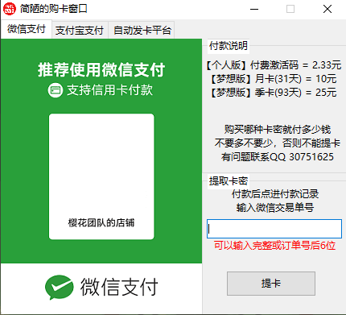
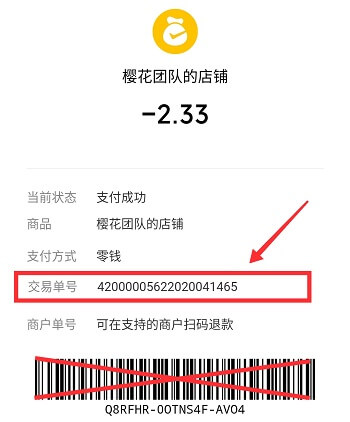
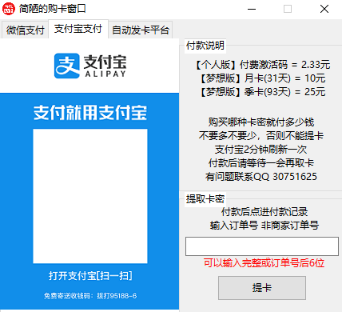
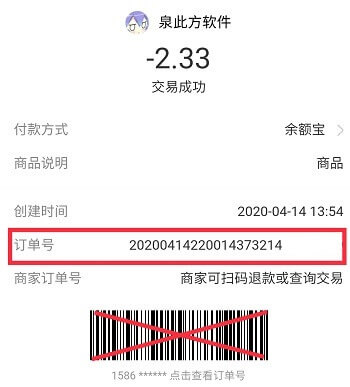

# 如何购买卡密

## 微信支付

1. 拿出手机，打开微信，扫码进入付款界面
2. 在**付款说明**中查看你需要购买的卡密类型以及对应的价格
3. 通过微信支付付款相应价格（请注意不要多不要少）
4. 在微信支付中找到你的付款，点击查看账单详情
5. 找到交易订单号，将其输入**提取卡密**区（可以只输入后6位）
6. 提卡成功，返回软件主界面，重新登录，填入你购买的卡密。

## 支付宝支付

1. 拿出手机，打开支付宝，扫码进入付款界面
2. 在**付款说明**中查看你需要购买的卡密类型以及对应的价格
3. 通过支付宝支付付款相应价格（请注意不要多不要少）
4. **等待2分钟（支付宝2分钟刷新一次订单）**
5. 在账单中找到你的付款，点击查看账单详情
6. 找到交易订单号，将其输入**提取卡密**区（可以只输入后6位）
7. 提卡成功，返回软件主界面，重新登录，填入你购买的卡密。

