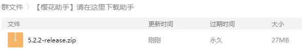

# 安装与启动

## 下载与启动

1.加入QQ群，打开群文件，找到 【樱花助手】 下载文件夹，下载以 版本号-release.zip 为格式的压缩包。


有时文件夹中可能会有多个这样的压缩包，您只需要下载版本号最高的即可。

您也可以前往官网首页下载。


2.将压缩包解压至任意文件夹中，然后双击小电视图标的**SakuraHelper.exe**，打开主程序。


如果出现提示 "连接服务器失败" 等提示时，请检查网络是否正常连接，国外用户建议翻回国使用助手。这个情况也有可能是服务器问题，点击 [https://status.bilibili.wiki/](https://status.bilibili.wiki/) 可以查看实时服务器状态。


## 选择登录版本

有两个选项可选，分别为“**个人版**”和“**梦想版**”。

具体说明见：



## 账号登录

在软件主界面上输入需要使用助手的B站账号和密码，然后点击登录。


此处登录输入的B站账号非UID！

建议输入手机号或者邮箱，你怎么登录B站的就输入什么进去登录。

樱花助手所有数据都是针对每一个B站账号的，所以无需另外注册樱花助手的账号。


## 激活樱花助手

为了防止助手的滥用与数据储存方便，需要激活樱花助手账号。

请按照界面要求输入**安全密码**，**QQ号**以及**激活码**。

激活成功后，重新登录即可进入软件。

