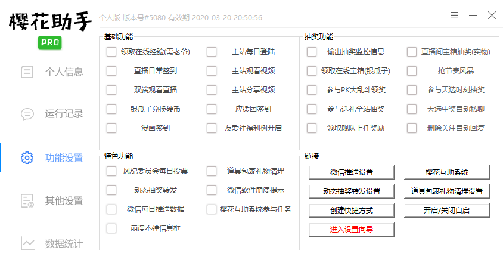

# 软件功能使用

## 各项功能说明

### 首页按钮功能介绍

**插件列表**：打开插件列表，用于展现所有已放置在plugin文件夹中的插件，并可以启用/停用，载入等。

**扭蛋机**：直播区的扭蛋机，消耗扭蛋币可以抽奖。

**绘马祈愿**：直播区的绘马祈愿，消耗银瓜子可以挂绘马，每天21点开奖。

**勋章管理**：快速管理自己所拥有的粉丝勋章，并提供佩戴、摘下、以及用20硬币兑换等功能。

**道具包裹**：管理自己的道具包裹，并且可以配合**勋章管理**一同使用，快速赠送。

**年度大会员领取B币券**：年度大会员快速领取B币券，并且可以选择兑换金瓜子或者给给作者投喂。

**头衔续期卡礼物箱**：一键领取所有未领取到包裹的头衔续期卡。

### 运行记录

运行记录用于展现所有功能运行时的信息，方便观察功能运行情况。

### 功能设置

#### **基础功能（仅对部分功能进行说明）**

**领取在线经验**：需要月度/年度老爷，每5分钟领取直播用户经验5000/7500。

**漫画签到**：哔哩哔哩漫画APP签到，领取漫画积分，兑换免费漫读券。

**友爱社福利树开启**：直播友爱社自动开启所有福利，需要账号时友爱社社长/副社长。

#### \*\*\*\*

#### **抽奖功能（仅对部分功能进行说明）**

**输出抽奖监控信息**：在运行记录中展示监控到的抽奖，单独选中此功能不会进行任何抽奖。

**直播间宝箱抽奖（实物）**：直播间内的官方宝箱抽奖，可以抽各种礼物（如小米10手机）。

**参与天选时刻抽奖**：有资格的UP主自己开启的抽奖，可能抽到0.01元红包等垃圾礼品。

**参与送礼全站抽奖**：小电视抽奖、摩天大楼抽奖和各种赠送后全区/全服可以收到提示的抽奖。

**天选中奖自动私聊**：（此功能需配置）天选中奖后自动进行私聊，防止某些UP说多久不回复作废。

**删除关注自动回复**：删除天选关注时产生的自动私聊。

#### **特色功能（仅对部分功能进行说明）**

**风纪委员会自动投票**：（此功能慎用），有风纪委资格的可以开启自动投票。

**道具包裹礼物清理**：（此功能需配置），每天定时自动清理包裹赠送指定主播，刷牌子亲密度。

**微信软件崩溃提示、微信每日推送数据**：（此功能需配置），微信公众号推送相关信息。



**樱花互助系统参与任务**：（此功能需配置），自动互助系统，给别人投币后可以让别人给你投币。



### **其他设置**

通过其他设置，可以对高级功能进行配置。

#### 漏抽设置（玄学）

取值范围：0~100，数值越高越容易不抽。

#### 天选设置

**天选正则例子**：

\(\(\[零0oO\]\|^\[零0oO\]\)\[.点、。\]\[\d一二三四五六七八九零壹贰叁肆伍陆柒捌玖Oo\]\)\|\[\d一二三四五六七八九零壹贰叁肆伍陆柒捌玖Oo\]\[分毛角\]\|\(图片\|照片\|写真\|相片\|排位\|车位\|一起\|代打\|加速器\|激活码\|空气\)

#### 节奏风暴



